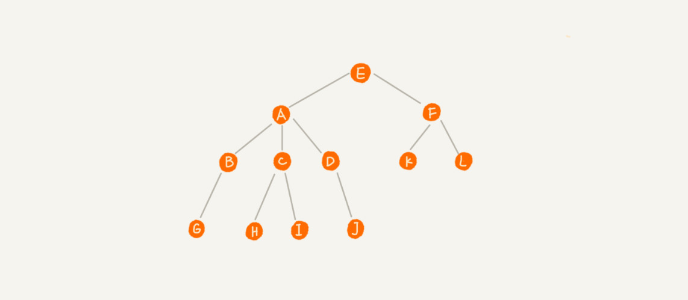
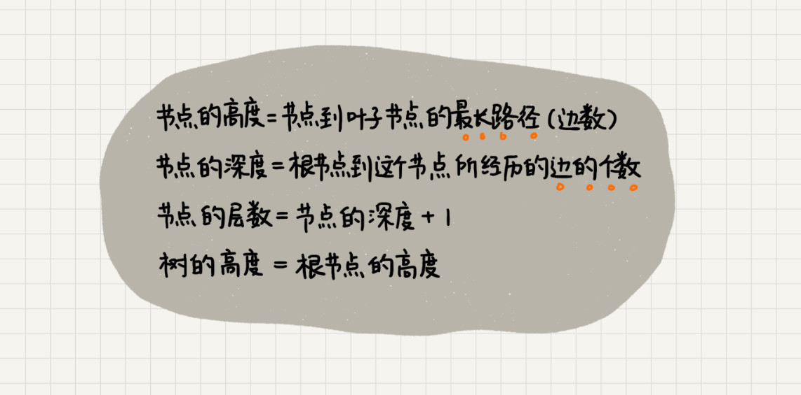
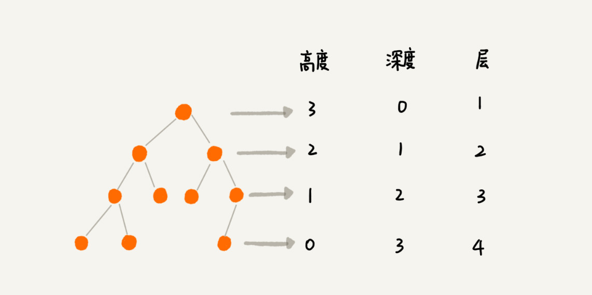
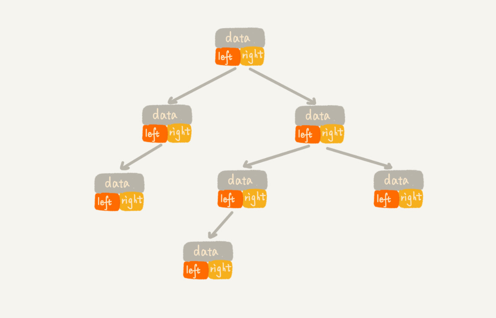
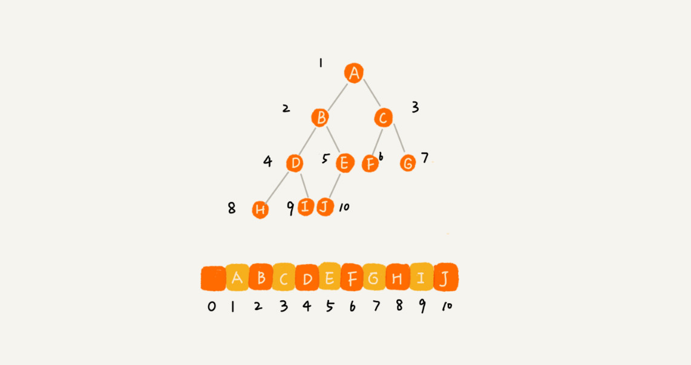
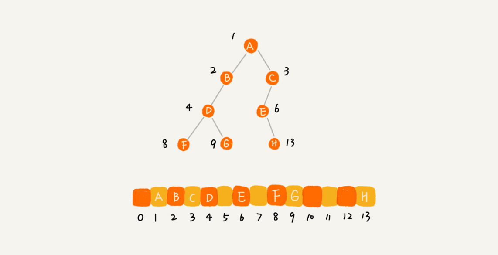
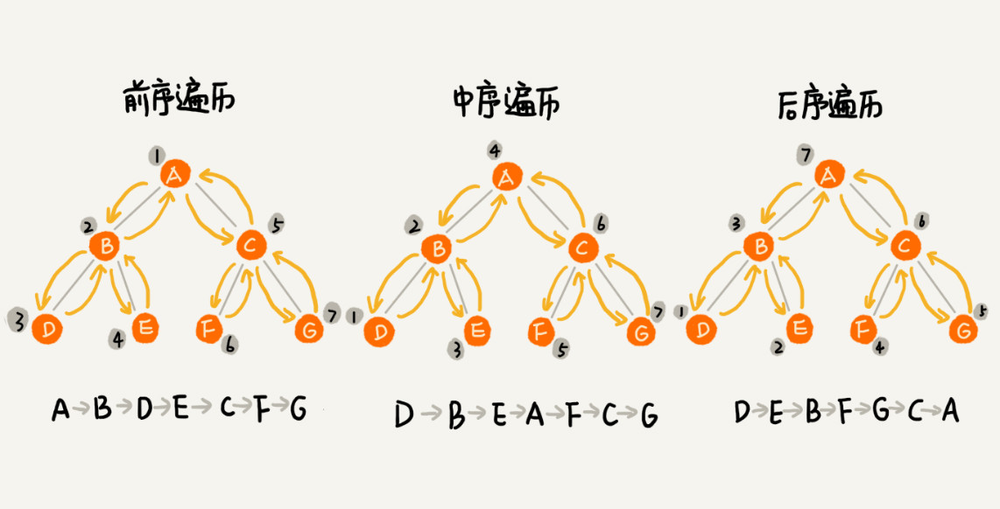
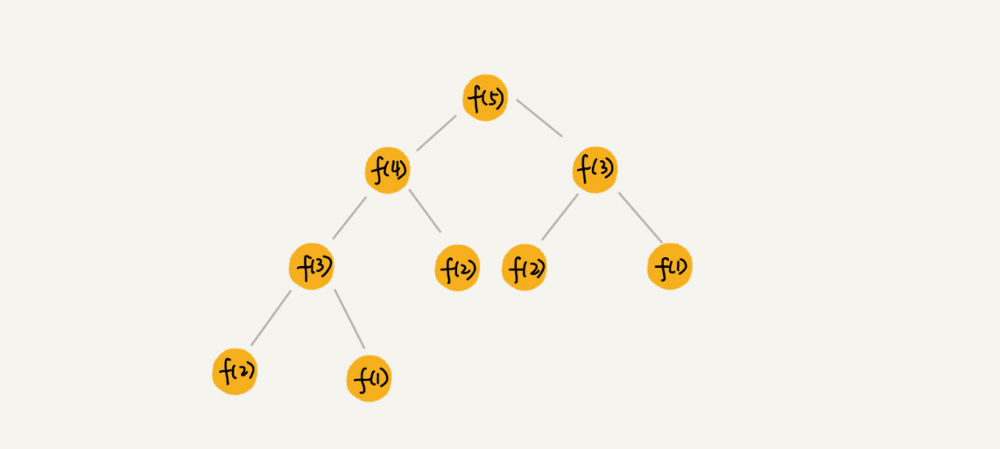

# 1、树（Tree）



 每个元素我们叫作“节点”；用来连线相邻节点之间的关系，叫作“父子关系” 。

- A 节点就是 B 节点的**父节点**，B 节点是 A 节点的**子节点**。

- B、C、D 这三个节点的父节点是同一个节点，互称为**兄弟节点**。

- 没有父节点的节点叫作**根节点**（E）;
- 没有子节点的节点叫作**叶子节点**或者**叶节点**(G..L)





# 2、二叉树

 二叉树，顾名思义，每个节点最多有两个“叉”，也就是两个子节点，分别是**左子节点**和**右子节点** 。

-  除了叶子节点之外，每个节点都有左右两个子节点，这种二叉树就叫作**满二叉树**。 
- 最后一层的叶子节点都靠**左**排列，其他层都是**满二叉树**，这种二叉树叫作**完全二叉树**。 

## 2.1 存储二叉树

###  2.1.1 基于引用的二叉链式存储法

 每个节点有三个字段，其中一个存储数据，另外两个是指向左右子节点的指针 。



### 2.1.2  基于数组的顺序存储法 

 如果节点 X 存储在数组中下标为 i 的位置，下标为 2 * i 的位置存储的就是左子节点，下标为 2 * i + 1 的位置存储的就是右子节点 ，同理 下标为 i/2 。



非完全二叉树：



## 2.2 二叉树的遍历

- **前序遍历**：对于树中的任意节点来说，先打印这个节点，然后再打印它的左子树，最后打印它的右子树。

- **中序遍历**：对于树中的任意节点来说，先打印它的左子树，然后再打印它本身，最后打印它的右子树。

- **后序遍历**：对于树中的任意节点来说，先打印它的左子树，然后再打印它的右子树，最后打印这个节点本身。

-  二叉树遍历的时间复杂度是 O(n)。

  

```java
//前序遍历
void preOrder(Node root) {
        if (root == null) return;
        System.out.println(root.data);  // 打印 root 节点
        preOrder(root.left);
        preOrder(root.right);
    }
//中序遍历
    void inOrder(Node root) {
        if (root == null) return;
        inOrder(root.left);
        System.out.println(root.data);  // 打印 root 节点
        inOrder(root.right);
    }
//后序遍历
    void postOrder(Node root) {
        if (root == null) return;
        postOrder(root.left);
        postOrder(root.right);
        System.out.println(root.data); // 打印 root 节点
    }
    class Node {
        public String data;  //节点数据
        public Node left;  //左孩子
        public Node right;  //右孩子
         public Node(String data) {
                this.data = data;
            }
    }
```

## 2.3 二叉查找树

 二叉查找树要求，在树中的任意一个节点，其**左子树**中的每个节点的值，都要**小于**这个节点的值，而**右子树**节点的值都**大于**这个节点的值 。

### 2.3.1 查找操作

 先取根节点，如果它等于我们要查找的数据，那就返回。如果要查找的数据比根节点的值小，那就在左子树中递归查找；如果要查找的数据比根节点的值大，那就在右子树中递归查找 。

```java
   public Node find(Node node,int data) {
        Node p = node;
        while (p != null) {
            if (data < p.data) p = p.left;
            else if (data > p.data) p = p.right;
            else return p;
        }
        return null;
    }
```

### 2.3.2 插入操作

 如果要插入的数据比节点的数据大，并且节点的右子树为空，就将新数据直接插到右子节点的位置；如果不为空，就再递归遍历右子树，查找插入位置。 

```java
public void insert(int data) {
  if (tree == null) {
    tree = new Node(data);
    return;
  }
 
  Node p = tree;
  while (p != null) {
    if (data > p.data) {
      if (p.right == null) {
        p.right = new Node(data);
        return;
      }
      p = p.right;
    } else { // data < p.data
      if (p.left == null) {
        p.left = new Node(data);
        return;
      }
      p = p.left;
    }
  }
}
```

### 2.3.3 删除操作

- 第一种情况是，如果要删除的节点没有子节点；

- 第二种情况是，如果要删除的节点只有一个子节点（只有左子节点或者右子节点）；

- 第三种情况是，如果要删除的节点有两个子节点。

```java
public void delete(int data) {
  Node p = tree; // p 指向要删除的节点，初始化指向根节点
  Node pp = null; // pp 记录的是 p 的父节点
  while (p != null && p.data != data) {
    pp = p;
    if (data > p.data) p = p.right;
    else p = p.left;
  }
  if (p == null) return; // 没有找到
 
  // 要删除的节点有两个子节点
  if (p.left != null && p.right != null) { // 查找右子树中最小节点
    Node minP = p.right;
    Node minPP = p; // minPP 表示 minP 的父节点
    while (minP.left != null) {
      minPP = minP;
      minP = minP.left;
    }
    p.data = minP.data; // 将 minP 的数据替换到 p 中
    p = minP; // 下面就变成了删除 minP 了
    pp = minPP;
  }
 
  // 删除节点是叶子节点或者仅有一个子节点
  Node child; // p 的子节点
  if (p.left != null) child = p.left;
  else if (p.right != null) child = p.right;
  else child = null;
 
  if (pp == null) tree = child; // 删除的是根节点
  else if (pp.left == p) pp.left = child;
  else pp.right = child;
}
```


## 3、红黑树

- 根节点是黑色的；
- 每个叶子节点都是黑色的空节点（NIL），也就是说，叶子节点不存储数据；
- 任何相邻的节点都不能同时为红色，也就是说，红色节点是被黑色节点隔开的；
- 每个节点，从该节点到达其可达叶子节点的所有路径，都包含相同数目的黑色节点；

具体实现参考[红黑树](红黑树（下）.pdf)

## 4、递归树

 递归的思想就是，将大问题分解为小问题来求解，然后再将小问题分解为小小问题。这样一层一层地分解，直到问题的数据规模被分解得足够小，不用继续递归分解为止。 

 如果我们把这个一层一层的分解过程画成图，它其实就是一棵树。我们给这棵树起一个名字，叫作**递归树**。 



