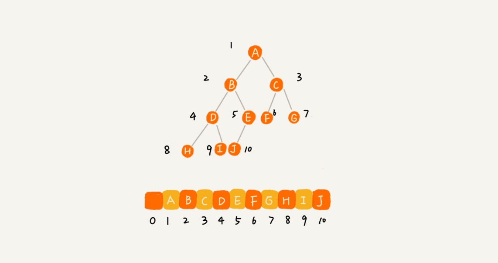

# 1、堆

- 堆是一个完全二叉树；
- 堆中每一个节点的值都必须大于等于（或小于等于）其子树中每个节点的值。

## 1.1 堆的实现
**完全二叉树比较适合用数组来存储!**

## 1.1 插入元素

 往堆中插入一个元素后，需要继续满足堆的两个特性。  如果我们把新插入的元素放到堆的最后 ,可能不满足第二个特效，需要进行堆化。

 堆化非常简单，就是顺着节点所在的路径，向上或者向下，对比，然后交换。 

## 1.2 删除堆顶元素

 从堆的定义的第二条中，任何节点的值都大于等于（或小于等于）子树节点的值，我们可以发现，堆顶元素存储的就是堆中数据的最大值或者最小值 。

 把最后一个节点放到堆顶，然后利用同样的父子节点对比方法。对于不满足父子节点大小关系的，互换两个节点，并且重复进行这个过程，直到父子节点之间满足大小关系为止。

# 2、堆排序

借助于堆这种数据结构实现的排序算法，就叫作堆排序。

时间复杂度非常稳定，是O(nlog⁡n)，并且它还是原地排序算法。 

具体实现参考[堆排序](堆和堆排序.pdf)

# 3、堆应用

## 3.1 优先级队列

 优先级队列，队列最大的特性就是先进先出，在优先级队列中，数据的出队顺序不是先进先出，而是按照优先级来，优先级最高的，最先出队 。

 往优先级队列中插入一个元素，就相当于往堆中插入一个元素；从优先级队列中取出优先级最高的元素，就相当于取出堆顶元素。 

## 3.2 利用堆求 Top K

## 3.3 利用堆求中位数
具体实现参考[堆应用](堆的应用.pdf)