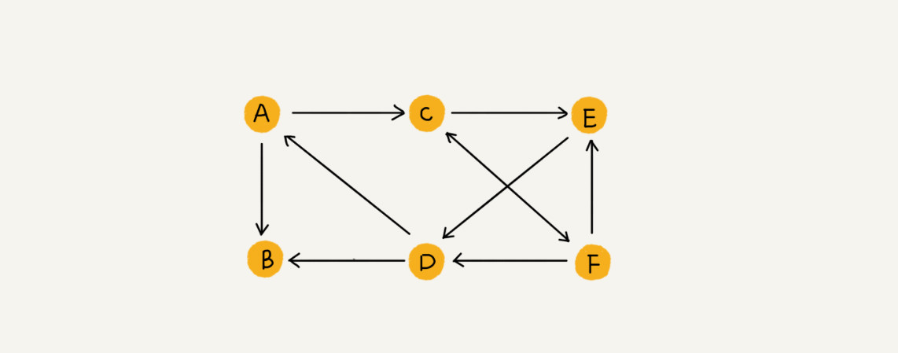
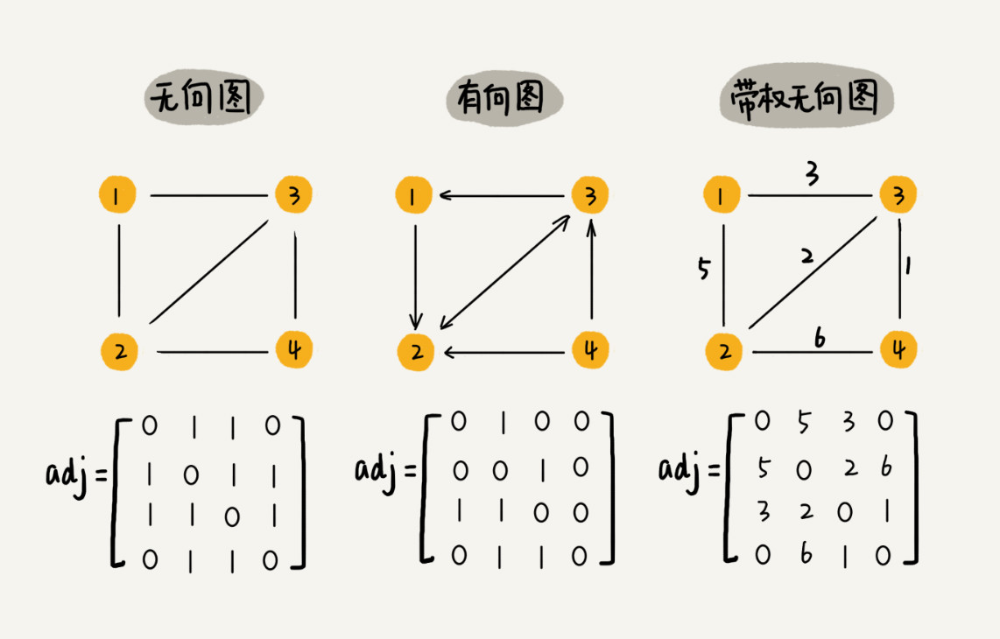
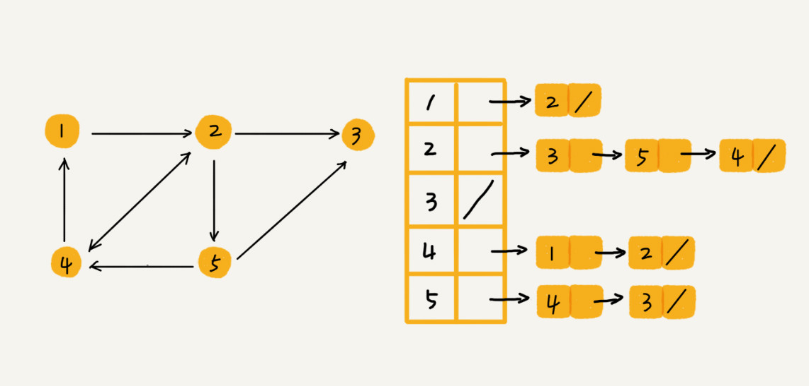
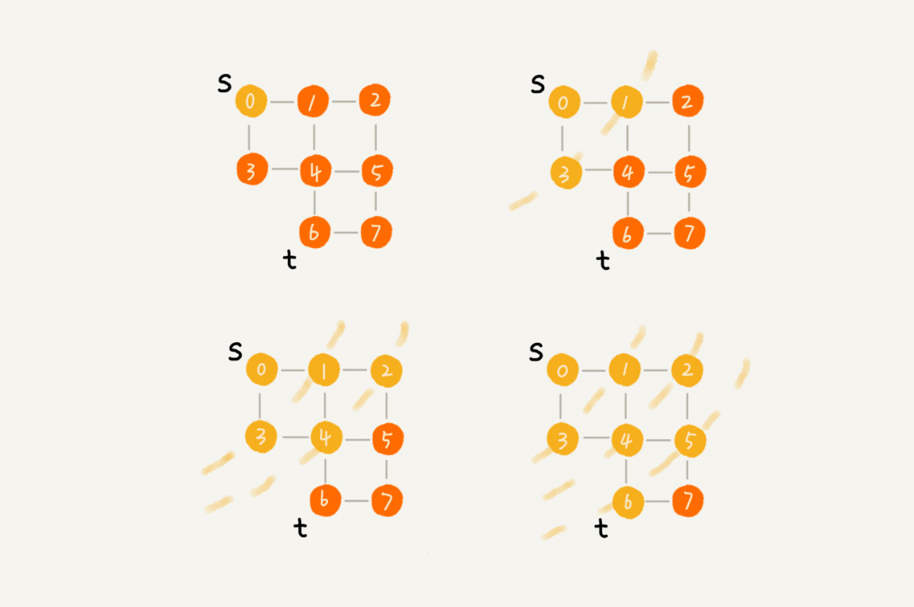
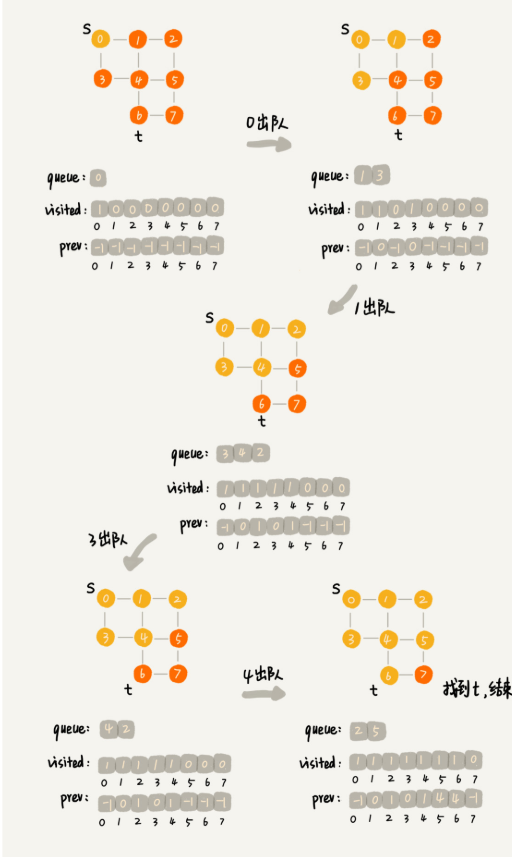
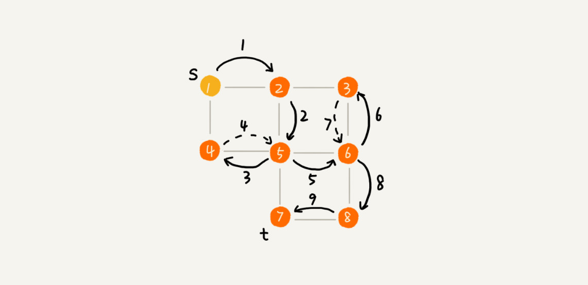

# 1、图

- 图中的元素我们就叫作**顶点;**
- 图中的一个顶点可以与任意其他顶点建立连接关系叫作**边;**
- 跟顶点相连接的边的条数叫作**度**;
-  **边**有方向的图叫作**有向图**，**边**没有方向的图就叫作**无向图** ;
-  顶点的**入度**，表示有多少条边指向这个顶点 ;
-  顶点的**出度**，表示有多少条边是以这个顶点为起点指向其他顶点 ;
-  **带权图**,每条边都有一个权重 。

# 2、图的存储

## 2.1 邻接矩阵

- 对于无向图来说，如果顶点 i 与顶点 j 之间有边，我们就将` A[i][j] `和` A[j][i] `标记为 1；
- 对于有向图来说，如果顶点 i 到顶点 j 之间，有一条箭头从顶点 i 指向顶点 j 的边，那我们就将` A[i][j] `标记为 1。
- 对于带权图，数组中就存储相应的权重。 

## 2.2 邻接表

 每个顶点对应一条链表，链表中存储的是与这个顶点相连接的其他顶点 。

# 3、图的遍历

## 3.1 广度优先搜索（BFS）

**广度优先搜索(遍历)** ：一种“地毯式”层层推进的搜索策略，即先查找离起始顶点最近的，然后是次近的，依次往外搜索 。(**求得的路径就是从 s 到 t 的最短路径**) 

**算法实践图:**

## 3.2 深度优先搜索（DFS）

 假设你站在迷宫的某个岔路口，然后想找到出口。你随意选择一个岔路口来走，走着走着发现走不通的时候，你就回退到上一个岔路口，重新选择一条路继续走，直到最终找到出口。这种走法就是一种深度优先搜索策略 

## 3.3 总结

- 广度优先搜索，地毯式层层推进，从起始顶点开始，依次往外遍历。广度优先搜索需要借助队列来实现，遍历得到的路径就是，起始顶点到终止顶点的**最短路径**。
- 深度优先搜索用的是回溯思想，非常适合用递归实现。深度优先搜索是借助栈来实现的。
- 在执行效率方面，深度优先和广度优先搜索的时间复杂度都是 O(E)，空间复杂度是 O(V)。 