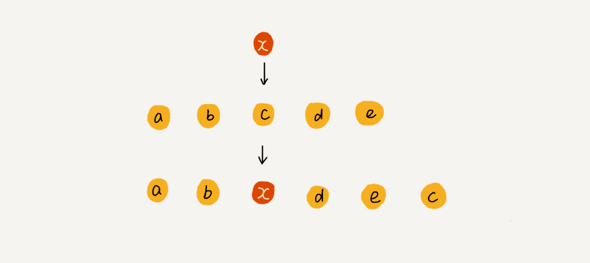

# 数组学习笔记

### 数组（Array）是一种线性表数据结构。它用一组连续的内存空间，来存储一组具有相同类型的数据。
 - 线性表：数据排成像一条线一样的结构，每个线性表上的数据最多只有前和后两个方向；
 - 连续的内存空间和相同类型的数据：实现了随机访问，但是这个让数组的很多操作变得非常低效，比如插入数据，需要做大量的数据搬移工作。 
 
 **Notes：数组适合查找操作，但是查找的时间复杂度并不为 O(1)，使用二分查找为O(logn)。数组支持随机访问，根据下标随机访问的时间复杂度为 O(1)。**

### 插入操作
正常情况下，每个位置插入元素的平均情况时间复杂度为 (1+2+…n)/n=O(n)；
如果不考虑元素的数据位置关系，直接将第 k 位的数据搬移到数组元素的最后，把新的元素直接放入第 k 个位置，时间复杂度就会降为 O(1)


### 警惕数组的访问越界问题

数组越界在 C 语言中是一种未决行为，并没有规定数组访问越界时编译器应该如何处理。因为，访问数组的本质就是访问一段连续内存，
只要数组通过偏移计算得到的内存地址是可用的，那么程序就可能不会报任何错误。Java 会做越界检查，越界就会抛出 java.lang.ArrayIndexOutOfBoundsException。

### 容器能否完全替代数组？

ArrayList 最大的优势就是**可以将很多数组操作的细节封装起来，同时支持动态扩容**，因为扩容操作涉及内存申请和数据搬移，是比较耗时的。
所以，如果事先能确定需要存储的数据大小，最好在创建 ArrayList 的时候事先指定数据大小：
```java
ArrayList<User> users = new ArrayList(10000);
for (int i = 0; i < 10000; ++i) {
  users.add(xxx);
}
```
1、Java ArrayList **无法存储基本类型**，比如 int、long，需要封装为 Integer、Long 类，而 Autoboxing、Unboxing 则有一定的性能消耗，所以如果特别关注性能，或者希望使用基本类型，就可以选用数组。

2、 当要表示多维数组时，用数组往往会更加直观。比如 Object[][] array；而用容器的话则需要这样定义：ArrayList<ArrayList > array。

Notes：对于业务开发，直接使用容器就足够了，省时省力。损耗一丢丢性能，完全不会影响到系统整体的性能；
但如果你是做一些非常底层的开发，比如开发网络框架，性能的优化需要做到极致，这个时候数组就会优于容器，成为首选。

### 数组从0开始编号

从数组存储的内存模型上来看，“下标”最确切的定义应该是“偏移（offset）”。如果用 a 来表示数组的首地址，a[0] 就是偏移为 0 的位置，也就是首地址，
a[k] 就表示偏移 k 个 type_size 的位置，所以计算 a[k] 的内存地址只需要用这个公式:
```java
a[k]_address = base_address + k * type_size
```
如果数组从 1 开始计数，那我们计算数组元素 a[k] 的内存地址就会变为：
```java
a[k]_address = base_address + (k-1)*type_size
```
从 1 开始编号，每次随机访问数组元素都多了一次减法运算，对于 CPU 来说，就是多了一次减法指令，数组作为非常基础的数据结构，效率的优化就要尽可能做到极致。