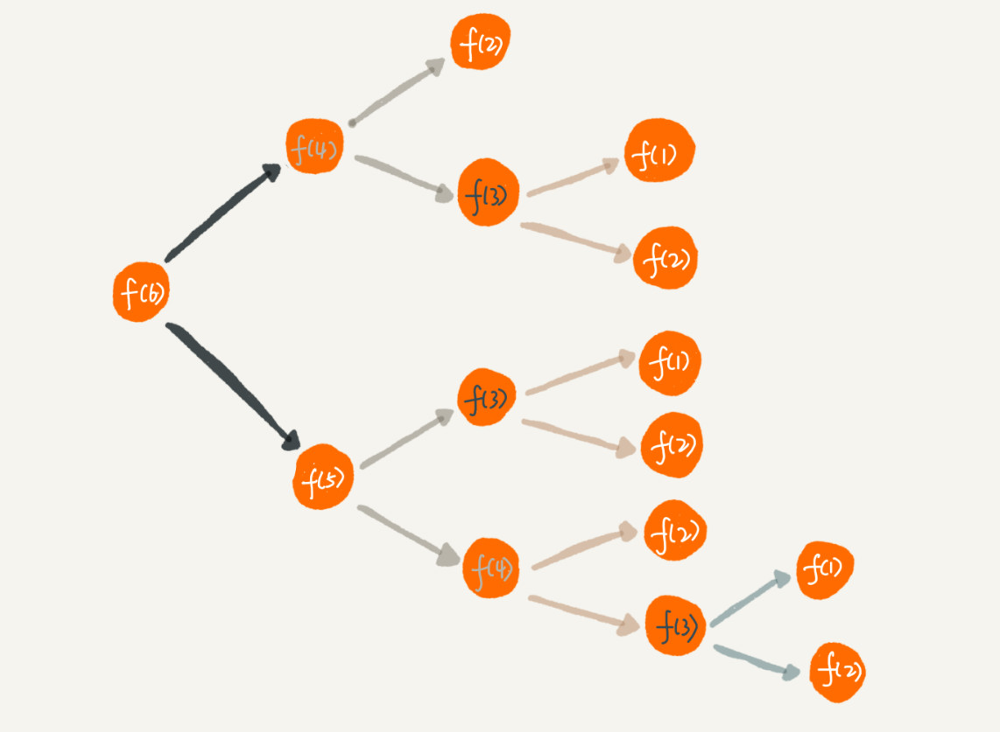

# 递归学习笔记

递归指的是在函数的定义中使用函数自身的方法。

周末你带着女朋友去电影院看电影，咱们现在坐在第几排啊？于是你就问前面一排的人他是第几排，你想只要在他的数字上加一，就知道自己在哪一排了。
但是，前面的人也看不清啊，所以他也问他前面的人。就这样一排一排往前问，直到问到第一排的人，说我在第一排，然后再这样一排一排再把数字传回来。
到你前面的人告诉你他在哪一排，于是你就知道答案了。

这就是一个非常标准的递归求解问题的分解过程，去的过程叫“递”，回来的过程叫“归”

### 递归需要满足的三个条件

- 一个问题的解可以分解为几个子问题的解
- 这个问题与分解之后的子问题，除了数据规模不同，求解思路完全一样
- 存在递归终止条件

### 如何编写递归代码？

写出递推公式，找到终止条件。
具体过程见[台阶问题分析](递归.pdf)

### 递归代码要警惕重复计算


可以直观地看到，想要计算 f(5)，需要先计算 f(4) 和 f(3)，而计算 f(4) 还需要计算 f(3)，因此，f(3) 就被计算了很多次，这就是重复计算问题。

以通过一个数据结构（比如散列表）来保存已经求解过的 f(k)。
```java
public int f(int n) {
  if (n == 1) return 1;
  if (n == 2) return 2;
  
  // hasSolvedList 可以理解成一个 Map，key 是 n，value 是 f(n)
  if (hasSolvedList.containsKey(n)) {
    return hasSovledList.get(n);
  }
  
  int ret = f(n-1) + f(n-2);
  hasSovledList.put(n, ret);
  return ret;
}
```
### 怎么将递归代码改写为非递归代码？

使用迭代循环来实现：

**Note: 编写递归代码的关键是，只要遇到递归，我们就把它抽象成一个递推公式，不用想一层层的调用关系，不要试图用人脑去分解递归的每个步骤。**