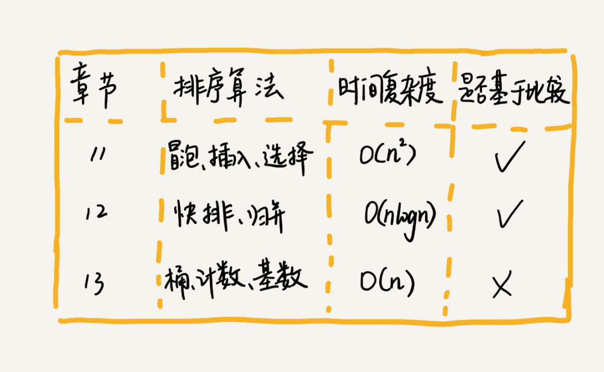
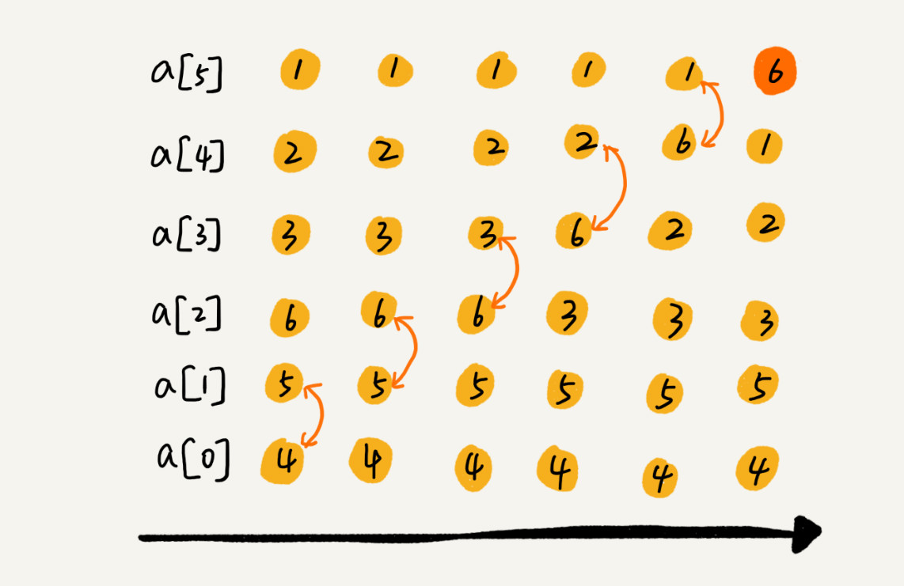
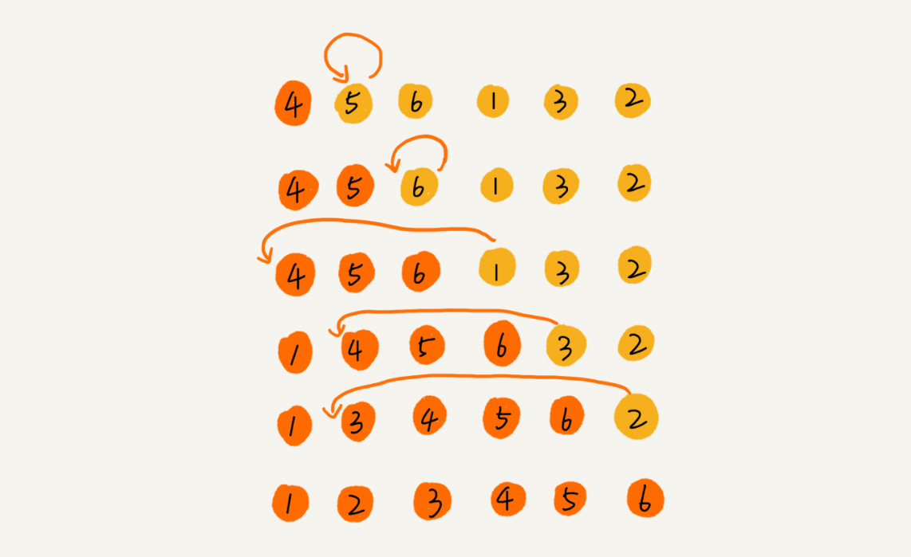
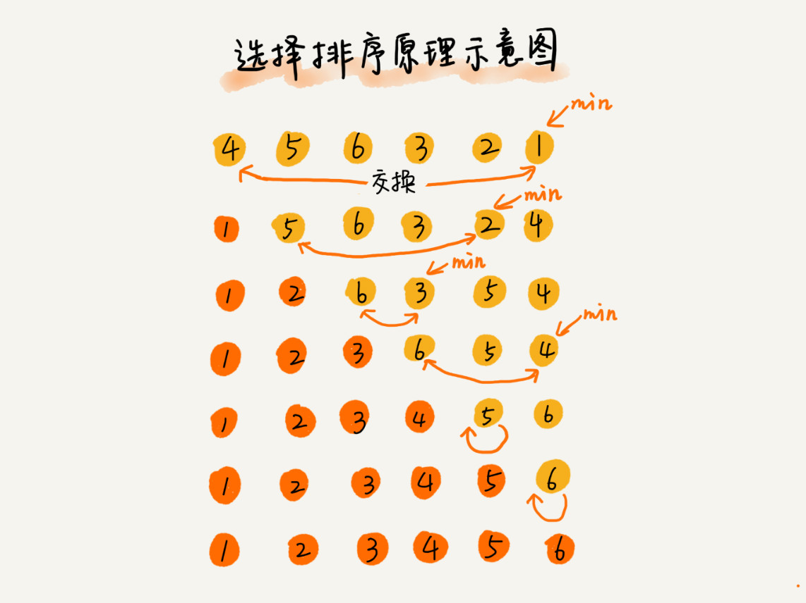
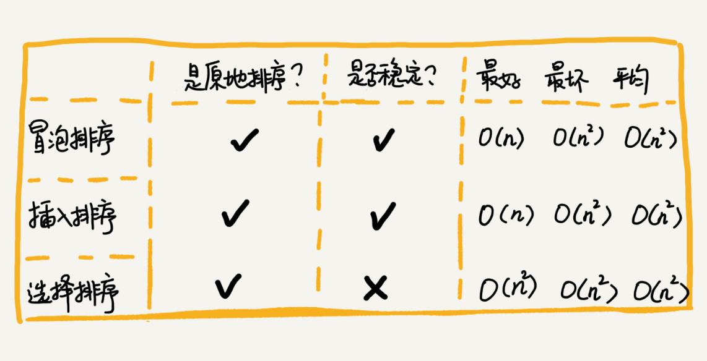
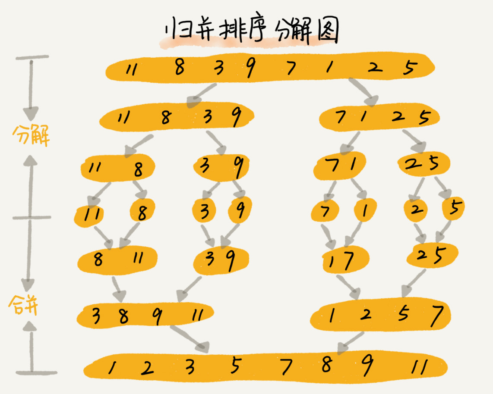
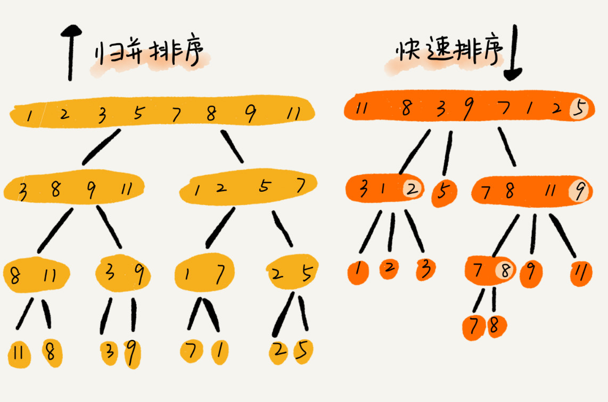
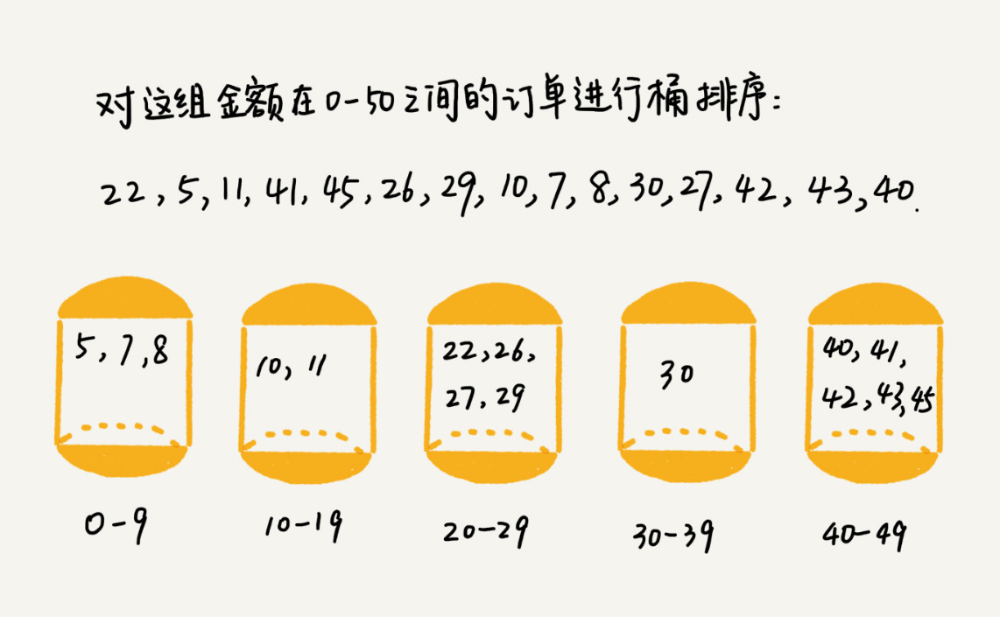

# 排序学习笔记




## 1、如何分析一个“排序算法”？


### 1.1 排序算法的执行效率

- 最好情况、最坏情况、平均情况时间复杂度
- 时间复杂度的系数、常数 、低阶
- 比较次数和交换（或移动）次数
### 1.2 排序算法的内存消耗
### 1.3 排序算法的稳定性
​     如果待排序的序列中存在值相等的元素，经过排序之后，相等元素之间原有的先后顺序不变。


## 2、复杂度O(n2)的排序


### 2.1 冒泡排序（Bubble Sort）



```java
// 冒泡排序，a 表示数组，n 表示数组大小
public void bubbleSort(int[] a, int n) {
  if (n <= 1) return;
 
 for (int i = 0; i < n; ++i) {
    // 提前退出冒泡循环的标志位
    boolean flag = false;
    for (int j = 0; j < n - i - 1; ++j) {
      if (a[j] > a[j+1]) { // 交换
        int tmp = a[j];
        a[j] = a[j+1];
        a[j+1] = tmp;
        flag = true;  // 表示有数据交换      
      }
    }
    if (!flag) break;  // 没有数据交换，提前退出
  }
}
```


### 2.2 插入排序（Insertion Sort）



```java
// 插入排序，a 表示数组，n 表示数组大小
public void insertionSort(int[] a, int n) {
  if (n <= 1) return;
 
  for (int i = 1; i < n; ++i) {
    int value = a[i];
    int j = i - 1;
    // 查找插入的位置
    for (; j >= 0; --j) {
      if (a[j] > value) {
        a[j+1] = a[j];  // 数据移动
      } else {
        break;
      }
    }
    a[j+1] = value; // 插入数据
  }
}
```


### 2.3 选择排序（Selection Sort）



```java
public void  SelectSort(int[] array){
     int temp;
    for (int i = 0; i < array.Length; i++){
        int min = i;

        for (int j = i+1; j < array.Length; j++){
            if (array[j] < array[min])
                    min = j;
        }
        //不用一直交换，只需要最后交互一次
        if (min != i){
         
            temp = array[i];
            array[i] = array[min];
            array[min] = temp;
        }
    }
}
```


### 2.4 三种排序对比图




### 2.5 为什么插入排序要比冒泡排序更受欢迎呢？

冒泡排序和插入排序的时间复杂度都是 O(n2)，都是原地排序算法；
冒泡排序的数据交换要比插入排序的数据移动要复杂，冒泡排序需要 3 个赋值操作，而插入排序只需要 1 个：
```java
//冒泡排序中数据的交换操作：
if (a[j] > a[j+1]) { // 交换
   int tmp = a[j];
   a[j] = a[j+1];
   a[j+1] = tmp;
   flag = true;
}
 
//插入排序中数据的移动操作：
if (a[j] > value) {
  a[j+1] = a[j];  // 数据移动
} else {
  break;
}
```


## 3、复杂度O(nlogn)的排序

### 3.1 归并排序



```java
public  void mergeSort(int[] arr, int low, int high) {
    int mid = (low + high) / 2;
    if (low < high) {
        // 左边
        mergeSort(arr, low, mid);
        // 右边
        mergeSort(arr, mid + 1, high);
        // 左右归并
        merge(arr, low, mid, high);
        System.out.println(Arrays.toString(arr));
}

 public  void merge(int[] arr, int low, int mid, int high) {
        int[] temp = new int[high - low + 1];
        int i = low;// 左指针
        int j = mid + 1;// 右指针
        int k = 0;
        // 把较小的数先移到新数组中
        while (i <= mid && j <= high) {
            if (arr[i] < arr[j]) {
                temp[k++] = arr[i++];
            } else {
                temp[k++] = arr[j++];
            }
        }
        // 把左边剩余的数移入数组
        while (i <= mid) {
            temp[k++] = arr[i++];
        }
        // 把右边边剩余的数移入数组
        while (j <= high) {
            temp[k++] = arr[j++];
        }
        // 把新数组中的数覆盖nums数组
        for (int k2 = 0; k2 < temp.length; k2++) {
            arr[k2 + low] = temp[k2];
        }
    }

 }

```


### 3.2 快速排序



```java
 private    void quickSort(int[] R, int low, int high){
         if(low>=high) return;
         int  pivotLoc = partition(R, low, high);
         quickSort(R, low, pivotLoc - 1);
         quickSort(R, pivotLoc + 1, high);
         
        System.out.println(Arrays.toString(R));
 }

 private  int partition(int[] R, int low, int high){
        int p = R[low]; // p,这里就是每个数组的第一个
        while (low < high){
            //右边当发现小于temp的值时停止循环
            while (low < high && p <= R[high]){
                 high--;
            }

            //把小于p的值复制到右边，这个high的值此时为空
            R[low] = R[high];

            //左边当发现大于p的值时停止循环
            while (low < high && p >= R[low]) {
                 low++;
            }
            //把左边大的值赋值到右边high的空位置上
            R[high] = R[low];
        }
        //结束循环，赋值p
        R[low] = p;
      return low;
}


```

**优化快速排序，两个比较常用、比较简单的分区算法:**

- 1、 三数取中法：从区间的首、尾、中间，分别取出一个数，然后对比大小，取这 3 个数的中间值作为分区点。
- 2、 随机法


### 3.3 三种比较

- 归并排序和快速排序是两种稍微复杂的排序算法，它们用的都是分治的思想，代码都通过递归来实现，过程非常相似。
- 归并排序算法是一种在任何情况下时间复杂度都比较稳定的排序算法,即归并排序不是原地排序算法，空间复杂度比较高，是 O(n)。正因为此，它也没有快排应用广泛。
- 快速排序算法虽然最坏情况下的时间复杂度是 O(n2)，但是平均情况下时间复杂度都是 O(nlogn)。不仅如此，快速排序算法时间复杂度退化到 O(n2) 的概率非常小，我们可以通过合理地选择 pivot 来避免这种情况。
- **堆排序和快速排序都有比较多的应用，比如 Java 语言采用堆排序实现排序函数，C 语言使用快速排序实现排序函数**。


## 4、复杂度O(n)的排序   

### 4.1 桶排序（Bucket sort）


```java
public static void bucketSort(int[] arr){
    
    int max = Integer.MIN_VALUE;
    int min = Integer.MAX_VALUE;
    for(int i = 0; i < arr.length; i++){
        max = Math.max(max, arr[i]);
        min = Math.min(min, arr[i]);
    }
    
    //桶数
    int bucketNum = (max - min) / arr.length + 1;
    ArrayList<ArrayList<Integer>> bucketArr = new ArrayList<>(bucketNum);
    for(int i = 0; i < bucketNum; i++){
        bucketArr.add(new ArrayList<Integer>());
    }
    
    //将每个元素放入桶
    for(int i = 0; i < arr.length; i++){
        int num = (arr[i] - min) / (arr.length);
        bucketArr.get(num).add(arr[i]);
    }
    
    //对每个桶进行排序
    for(int i = 0; i < bucketArr.size(); i++){
        Collections.sort(bucketArr.get(i));
    }
    
    System.out.println(bucketArr.toString());
    
}
```


### 4.2 计数排序（Counting sort）

```java
public static void countSort(int range,int[] array){
     int[] buckets = new int[range];//空间换时间
    
    
         for(int i=0;i<array.length;i++){
             buckets[array[i]]++;
         }
    
    
     for (int i = 0; i < buckets.length; i++)         {
         for(int j=1;j<=buckets[i];j++)  //值1开始，
             System.out.println(i);
     }
}
```
**计数排序其实是桶排序的一种特殊情况**,具体实现参考[文章](https://www.cnblogs.com/zer0Black/p/6169858.html)


### 4.3 基数排序（Radix sort）

参考[文章](https://segmentfault.com/a/1190000013986116)


