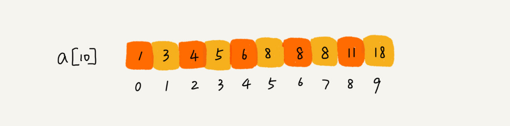

## 1、二分查找

二分查找针对的是一个有序的数据集合，查找思想有点类似分治思想。每次都通过跟区间的中间元素对比，将待查找的区间缩小为之前的一半，直到找到要查找的元素，或者区间被缩小为 0 。

### 1.1  **O(logn) 惊人的查找速度**

```java
public int bsearch(int[] a, int value) {
  int low = 0;
  int high = a.length;
 
  while (low <= high) {
    int mid = (low + high) / 2;
      
    if (a[mid] == value) {
      return mid;
    } else if (a[mid] < value) {
      low = mid + 1;
    } else {
      high = mid - 1;
    }
  }
 
  return -1;
}
```

**容易出错的 3 个地方**:

- 循环退出条件： 注意是 low<=high，而不是 low<high。
- mid 的取值：mid=(low+high)/2 ，如果两数之和较大会溢出，可以改为low+(high-low)/2
- low 和 high 的更新： low=mid+1，high=mid-1。 

### 1.2 二分查找应用场景的局限性

- 二分查找依赖的是顺序表结构，简单点说就是数组;
-  二分查找针对的是有序数据 ;
-  数据量太小不适合二分查找;
-  数据量太大也不适合二分查找。 

### 1.3 4个变形问题



#### 	1.3.1：查找第一个值等于给定值的元素

```java
public int bsearch(int[] a, int n, int value) {
  int low = 0;
  int high = n - 1;
  while (low <= high) {
    int mid =  low + ((high - low) >> 1);
    if (a[mid] > value) {
      high = mid - 1;
    } else if (a[mid] < value) {
      low = mid + 1;
    } else {
      if ((mid == 0) || (a[mid - 1] != value)) return mid;//前面还有相等元素继续执行。
      else high = mid - 1;
    }
  }
  return -1;
}
```

 #### 	1.3.2：查找最后一个值等于给定值的元素

```java
public int bsearch(int[] a, int n, int value) {
  int low = 0;
  int high = n - 1;
  while (low <= high) {
    int mid =  low + ((high - low) >> 1);
    if (a[mid] > value) {
      high = mid - 1;
    } else if (a[mid] < value) {
      low = mid + 1;
    } else {
      if ((mid == n - 1) || (a[mid + 1] != value)) return mid;//只需要判断是否是最后一个或者后一个是不是还相等
      else low = mid + 1;
    }
  }
  return -1;
}
```

#### 	1.3.3： 查找第一个大于等于给定值的元素

```java
public int bsearch(int[] a, int n, int value) {
  int low = 0;
  int high = n - 1;
  while (low <= high) {
    int mid =  low + ((high - low) >> 1);
    if (a[mid] >= value) {
      if ((mid == 0) || (a[mid - 1] < value)) return mid;
      else high = mid - 1;
    } else {
      low = mid + 1;
    }
  }
  return -1;
}
```

#### 1.3.4：查找最后一个小于等于给定值的元素

```java
public int bsearch7(int[] a, int n, int value) {
  int low = 0;
  int high = n - 1;
  while (low <= high) {
    int mid =  low + ((high - low) >> 1);
    if (a[mid] > value) {
      high = mid - 1;
    } else {
      if ((mid == n - 1) || (a[mid + 1] > value)) return mid;
      else low = mid + 1;
    }
  }
  return -1;
}
```


