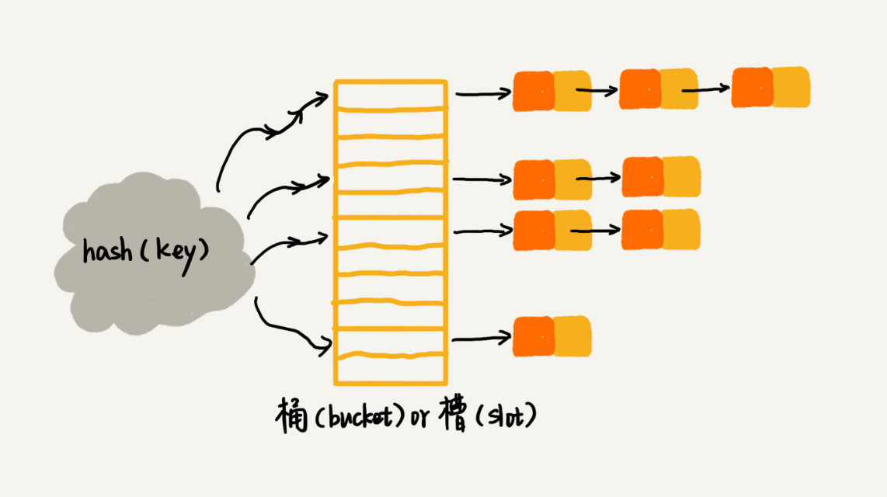

## 1、散列思想

 散列表用的是数组支持按照下标随机访问数据的特性，所以散列表其实就是数组的一种扩展，由数组演化而来。可以说，如果没有数组，就没有散列表。 

## 2、散列函数

 它是一个函数。我们可以把它定义成**hash(key)**，其中 key 表示元素的键值，hash(key) 的值表示经过散列函数计算得到的散列值。 

**三点散列函数基本要求：**

- 散列函数计算得到的散列值是一个非负整数；
- 如果 key1 = key2，那 hash(key1) == hash(key2)；
- 如果 key1 ≠ key2，那 hash(key1) ≠ hash(key2)。 **再好的散列函数也无法避免散列冲突** 

## 3、散列冲突

### 3.1 开放寻址法

 开放寻址法的核心思想是，如果出现了散列冲突，我们就重新探测一个空闲位置，将其插入 。

-  **线性探测** ： 往散列表中插入数据时，如果某个数据经过散列函数散列之后，存储位置已经被占用了，从当前位置开始，依次往后查找，看是否有空闲位置，直到找到为止 。

-  **二次探测** ： 跟线性探测很像，线性探测每次探测的步长是 1，而二次探测探测的步长就变成了原来的“二次方”。

-  **双重散列** ： 不仅要使用一个散列函数。我们使用一组散列函数， 如果计算得到的存储位置已经被占用，再用第二个散列函数，依次类推，直到找到空闲的存储位置 

### 3.2  链表法

 链表法是一种更加常用的散列冲突解决办法，相比开放寻址法，它要简单很多。 

 在散列表中，每个“桶（bucket）”或者“槽（slot）”会对应一条链表，所有散列值相同的元素我们都放到相同槽位对应的链表中 。

 

### 3.3 适用场景

- 当数据量比较小、装载因子小的时候，适合采用**开放寻址法**。这也是 Java 中的ThreadLocalMap使用开放寻址法解决散列冲突的原因。 
-  基于**链表**的散列冲突处理方法比较适合存储大对象、大数据量的散列表，而且，比起开放寻址法，它更加灵活，支持更多的优化策略，比如用红黑树代替链表。 

## 4、优化散列表

### 4.1  设计合适的散列函数

-  散列函数的设计不能太复杂 ；
-  散列函数生成的值要尽可能随机并且均匀分布 ；
-  综合考虑各种因素：关键字的长度、特点、分布、还有散列表的大小 

### 4.2  优化装载因子过大

 装载因子越大，说明散列表中的元素越多，空闲位置越少，散列冲突的概率就越大 。

-  没有频繁插入和删除的静态数据集合来说，直接初始化合适的散列表长度。
-  对于动态散列表来说，数据集合是频繁变动的 ，进行动态扩容。随着数据的删除，散列表中的数据会越来越少，空闲空间会越来越多，可以选择动态缩容。

 为了解决一次性扩容耗时过多的情况，我们可以将扩容操作穿插在插入操作的过程中，分批完成。当装载因子触达阈值之后，我们只申请新空间，但并不将老的数据搬移到新散列表中 。

### 4.3  Java HashMap 举例分析

- **初始大小：**HashMap 默认的初始大小是 16， 事先知道大概的数据量有多大，  修改默认初始大小，减少动态扩容的次数 ；
- **装载因子和动态扩容：**最大装载因子默认是 0.75；
- **散列冲突解决方法：**采用链表法来解决冲突， 在 JDK1.8 版本中， 做进一步优化，引入了红黑树。 

## 5、 哈希算法 

 任意长度的二进制值串映射为固定长度的二进制值串( **哈希值** )，这个映射的规则就是**哈希算法** 。  业界著名的哈希算法也有很多，比如 MD5、SHA 等。 

- 从哈希值不能反向推导出原始数据（所以哈希算法也叫单向哈希算法）；
- 对输入数据非常敏感，哪怕原始数据只修改了一个 Bit，最后得到的哈希值也大不相同；
- 散列冲突的概率要很小，对于不同的原始数据，哈希值相同的概率非常小；
- 哈希算法的执行效率要尽量高效，针对较长的文本，也能快速地计算出哈希值。

 哈希算法的应用：

- **安全加密：**最常用于加密的哈希算法是**MD5、SHA、DES、AES**
- **唯一标识：** 比如给每一个图片取一个唯一标识，或者说信息摘要 
- **数据校验：** 文件下载，网络传输是不安全的，下载的文件块有可能是被宿主机器恶意修改过的 。
- **散列函数**
- **负载均衡：** 负载均衡算法有很多，比如轮询、随机、加权轮询等 
- **数据分片：** 
- **分布式存储**

